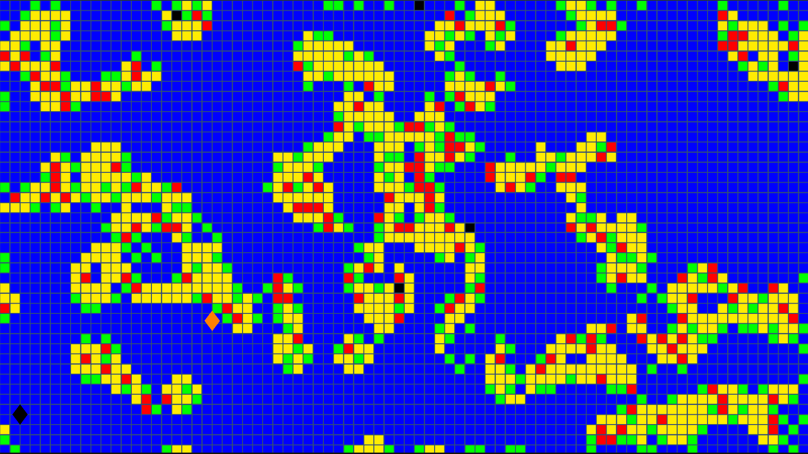
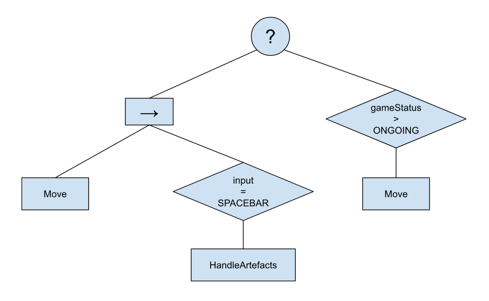

# Diver vs. Mermaid
**_An interactive agents and procedural generation project_**

For assignment information, click [here](https://github.com/pranigopu/interactiveAgents--proceduralGeneration/tree/8e12283e68ef78dbc29b8d732ae1f5895b7a15ab/project).

This project is a part of my MSc. AI's "Interactive Agents and Procedural Generation" course and aims to create a game using cellular automata for level generation and behaviour trees for interactive agents.

# Video links
Brief (sort of flashy) showcase of the project (1 min 22 sec): <br> https://youtu.be/sJMKtEH5r3g?si=hqPYJZtHNCJJt4GA

Closer look into level generation in the project (2 min 22 sec): <br> https://www.youtube.com/watch?v=U8jWge2X8Og

# How to play?
- Use W-A-S-D or arrow keys to move the black rhombus (diver, i.e. you) across the map
- Use SPACEBAR to pick or place black tiles (artefacts)
- Avoid the projectiles of the orange rhombus (mermaid)
- Do not let the mermaid get too close, her melee attacks are worse!
- Stay out of the mermaid's sight by hiding in the underwater growth (coral and seaweed)
- Collect all the artefacts without dying and you win!
- NOTE: You incur a movement speed penalty directly proportional to the number of artefacts collected

**SCORE**:

- Inversely proportional to the time taken to win (if you lose, you get no score)
- Directly proportional to the health remaining upon winning
- Score = $\frac{1000 \times HP}{t}$ (HP = health points remaining, t = time taken)

**REPLAYING / REGENERATING MAPS**:

- To regenerate the map and thus replay the game, press ENTER/RETURN
- **NOTE**: The level generation and game restart may take a few seconds
- To generate the map by stages (for curiosity):
    - Press 0 to generate a new randomly filled grid
    - Press 1 to apply coral cellular automaton
    - Press 2 to apply water cellular automaton
    - Press 3 to apply seaweed cellular automaton

**SOME TIPS**:

- Placing an artefact replaces any tile with the artefact tile
- Picking an artefact replaces the artefact tile with a water tile (blue)
- Do not spam SPACEBAR! There is a 0.5-second cooldown before you can pick or place

_More information about the tile types is given in the next section_...

# Level generator design
The level generator relies on random fill (based on preset proportions) to generate the initial grid (stage A), on which it them applies three cellular automata for a set number of iterations each (stage B). In these stages, the code works only with a 2D integer array (the `grid` variable in `LevelGenerator.cs`), altering the integers so as to represent the following tile types:

- 0 = Water
- 1 = Seaweed
- 2 = Yellow coral
- 3 = Red coral

---

**MORE ABOUT EACH TILE TYPE**:

Each of the aforementioned tile types have unique properties:

- <b style="color:blue;">Water</b>: Allows fast travel
- <b style="color:green;">Seaweed</b>: Provides cover and allows relatively fast travel (though a bit slower than water)
- <b style="color:yellow;">Yellow coral</b>: Provides cover and allows only relatively slow travel
- <b style="color:red;">Red coral</b>: Provides cover but hinders travel significantly (almost to a halt)

**NOTE**: _These properties apply only to the diver agent (the player); the mermaid can move freely across the map._

---

Finally, we have post-processing (stage C) wherein we (1) place artefacts at random around the map (indicated in the grid by assigning the associated cell the integer value $-1$) and (2) generate the final level's tilemap. The tilemap implements the grid using tiles of the appropriate textures (they are auto-generated solid colour textures by default, but custom textures can also be applied). By default, the color-to-tile mapping is as follows:

- Water = Blue
- Seaweed = Green
- Yellow coral = Yellow
- Red coral = Red
- Artefact = Black

_Now, each of the above stages shall be detailed more technically_...

## STAGE A: Initial 2D grid of filled and empty cells
The grid initialisation simply iterates through every possible position of the predefined play area and fills the grid associated with that position according to the above percentages. First, it begins by deciding whether to fill the tile or not based on `randomFillPercent`. If no, it assigns 0 to the grid cell and continues to the next position. If yes, it then decides whether to fill the tile as a seaweed or not based on `seaweedPercent`. If yes, it assigns 1 to the grid cell and continues to the next position. If no, it decides whether to fill the tile as a yellow coral or not based on `yelloCoralPercent`. If yes, it assigs 2 to the grid cell and continues to the next position. If no, it assigns 3 (for red coral) to the grid cell. The whole process goes on until every possible position is covered.

---

For reference, here is the code for the associated function:

```c
public void InitialiseGrid()
{
    
    // Initialising random number generator using seed:
    System.Random prng = InitialisePRNG();

    // Iterate over grid positions
    for (int x = 0; x < width; x++)
    {
        for (int y = 0; y < height; y++)
        {
            // Fill the grid according to `randomFillPercent`
            if(prng.Next(0, 100) < randomFillPercent)
            {
                if(prng.Next(0, 100) < seaweedPercent)
                    grid[x, y] = 1;
                else if(prng.Next(0, 100) < yellowCoralPercent)
                    grid[x, y] = 2;
                else
                    grid[x, y] = 3;
            }
            else
                grid[x, y] = 0;
        }
    }
}
```

Here, we see three key variables:

- `randomFillPercent`: Specifies how much of the map should be non-water tiles (excluding artefacts)
- `seaweedPercent`: Specifies how much of the map should be seaweed tiles
- `yellowCoralPercent`: Specifies how much of the map should be yellow coral tiles

Note that $CoralPercent = 1 -$ `seaweedPercent`, and it is with respect to $CoralPercentage$ that `yellowCoralPercent` is defined. Hence, note that $RedCoralPercent = 1 -$ `yellowCoralPercent`. Hence, $CoralPercentage$ and $RedCoralPercent$ are not defined as they are directly inferred from `seaweedPercent` and `yellowCoralPercent`.

## STAGE B: Cellular automata
### STAGE B.1: Getting relevant neighbourhood data
Before applying cellular automata, some data about the neighbourhood of a grid cell needs to be obtained (for example, how many cells around it are filled). The data obtained can be used within conditions that determine how the given cell is to be altered. For the cellular automata used later, three kinds of data are obtained:

1. Number of cells of a each tile type around the given cell in a $3 \times 3$ neighbourhood
2. Number of cells of a each tile type around the given cell in a $5 \times 5$ neighbourhood
3. Number of cells of a each tile type adjacent to the given cell (adjacent $implies$ non-diagonal immediate neighbour)

**NOTE**: _Artefacts are not relevant for the cellular automata; they are placed in post-processing._

---

For reference, here is the code for the associated function:

```c
[HideInInspector] public int[] moore_3 = {0, 0, 0, 0};
[HideInInspector] public int[] moore_5 = {0, 0, 0, 0};
[HideInInspector] public int[] vonNeumann_4 = {0, 0, 0, 0};

public void UpdateNeighbourhoodData(int x, int y)
// Types: 0 = Water, 1 = Seaweed, 2 = Red Coral, 3 = Yellow Coral
{
    // Clearing previous values:
    for(int i = 0; i < 4; i++)
    {
        moore_3[i] = 0;
        moore_5[i] = 0;
        vonNeumann_4[i] = 0;
    }

    // Iterating through the 5 x 5 neighbourhood positions:
    for(int i = x - 2; i <= x + 2; i++)
    {
        for(int j = y - 2; j <= y + 2; j++)
        {
            // Conditions for skipping to next iteration...

            // Continue to next iteration if any of the following conditions are met:
            if((i == x && j == y) || i < 0 || i >= width || j < 0 || j >= height)
                continue;

            // Continue to next iteration if the current position has artefact:
            if(grid[i, j] == -1)
                continue;
            // NOTE:`grid[x, y] == 1` when (x, y) has an artefact

            //________________________
            // Gathering neighbourhood data...

            // Data regarding 5 x 5 neighbourhood:
            moore_5[grid[i, j]]++;
            
            // Conditions for obtaining the other data:
            bool condition1 = i >= x - 1 && i <= x + 1 && j >= y - 1 && j <= y + 1;
            bool condition2 = i == x || j == y;
            
            // Data regarding 3 x 3 neighbourhood:
            if(condition1)
                moore_3[grid[i, j]]++;
            // Data regarding adjacent cells:
            if(condition1 && condition2)
                vonNeumann_4[grid[i, j]]++;
        }
    }
}
```

---

The data (for each of the three kinds) are collected in three integer arrays of size four each:

1. `moore_3` (for the $3 \times 3$ Moore neighbourhood)
2. `moore_5` (for the $5 \times 5$ Moore neighbourhood)
3. `vonNeumann_4` (for 4 cell Von Neumann neighbourhood)

**NOTE**: _The indices correspond directly to the tile type, i.e. index 0 holds the number of water tiles, etc._

The function is called each time data about a particular grid cell (corresponding to a map position) is needed. All three are updated at once since it is more computationally economical that way. Furthermore, Storing data in global data structures rather than returning them in functions avoids the hassle of handling the return values when calling the function. The update process consists of iterating around a $5 \times 5$ Moore neighbourhood of the given cell and incrementing the count of the tile type encountered under certain conditions (of course, the given cell's own position is skipped). The primary conditions is to ensure that the position being traversed is not either the given cell's position or an artefact and is within the grid. The secondary conditions are to handle the counts of tile types within the $3 \times 3$ Moore neighbourhood (which is a subset of the $5 \times 5$ Moore neighbourhood) and the Von Neumann neighbourhood of the given cell.

**NOTE**: _The previous data of each array has to be cleared before update, hence the count-resetting loop at the start._

### STAGE B.2: Cellular automata
Three cellular automata are used for the following functions:

1. Growing corals (red and yellow)
2. Growing seaweed
3. Growing water spaces

They are applied sequentially, and each is applied for a set number of iterations. The order is key, because each cellular automaton relies on certain conditions to be effective, and these conditions are only achieved in a certain order. To illustrate this point, consider the following. The coral growth is made to happen in clusters that are not too large. _The randomly placed seaweed from stage A helps contain and shape the growth of coral clusters_. The water spaces are made to clear excess scattered non-water tiles ("scattered" here means surrounded by too many water tiles so as to not be a part any cluster). Finally, the seaweed is made to grow in scattered, non-clustered patterns so as to ensure the map has not just clean passageways amid clusters of hiding spaces that hinder movement but also some hiding spaces that do not hinder movement. The seaweed growth also introduces some aesthetic messinenss that may help make the map more closely resemble a natural underwater terrain. _Such seaweed growth is only viable if water spaces have been made to some extent (so that there are not too many scattered seaweed tiles leading to scattered seaweed growth and so that there is enough open water to expand into)_.

**NOTE: Updating the grid when applying cellular automata**: <br> Cellular automata are applied per pass (pass = traversing each cell exactly once) such that all the cells are first updated according to the original grid, then the original grid is reassigned as the updated grid (i.e. the updated grid becomes the original grid only after all the cells are updated). Hence, when updating the cell values, the values are assigned to a buffer grid array while referencing the original grid, and only after 1 pass are the buffer grid array's values (i.e. all the updated cell values) assigned to the original grid array.

---

For reference, here are the rules and functions for the three cellular automata:

_Some abbreviations to make rule definition more convenient_...

Abbreviation | Meaning
---|---
CUR | Current position / cell  / tile
M3-i | Number of cells of type i in CUR's $3 \times 3$ Moor neighbourhood
M5-i | Number of cells of type i in CUR's $5 \times 5$ Moor neighbourhood
VN-i | Number of cells of type i in CUR's 4 cell Von Neumann neighbourhood
coral | Red and/or yellow coral

**CORAL GROWTH**:

Rules:

- If CUR is water and M3-coral $\geq$ 4 and M5-coral $\leq$ 18, then CUR = coral
- If CUR is coral and M3-coral $\leq$ 1 and M5-coral $>$ 18, then CUR = water
- Else, CUR stays unchanged

```c
int GrowCoral(int x, int y, System.Random prng)
{
    UpdateNeighbourhoodData(x, y);
    
    // Relevant values (calculated for both coral types together):
    int a = moore_3[2] + moore_3[3];
    int b = moore_5[2] + moore_5[3];
    
    // If current tile is a water tile...
    if(grid[x, y] == 0)
    {
        if(a >= 4 && b <= 18)
        {
            // Randomly picking between coral types based on predetermined probabilities:
            if(prng.Next(0, 100) < yellowCoralPercent)
                return 2;
            else
                return 3;
        }
    }
    // If current tile is not a water or seaweed tile...
    else if(grid[x, y] == 2 || grid[x, y] == 3)
        if(a <= 1 || b > 18)
            return 0;

    return grid[x, y];
}
```

The first condition ensures that a water tile surrounded by enough coral tiles in a smaller ($3 \times 3$) Moore neighbourhood is turned to coral, provided there are not too many corals in a wider ($5 \times 5$) Moore neighbourhood. Furthermore, note that the coral tiles are picked in random based on the preset `yellowCoralPercent`; this is an easy and effective way of adding variety to the map both aesthetically and functionally. This ensures clustering and little to no scattered growth of coral. The second condition ensures that a coral tile surrounded by too few coral tiles in a smaller neighbourhood or by too many water tiles in a wider water tiles is overcome by water. This ensures that any scattered coral tiles are removed, further ensuring clustering of coral.

**WATER GROWTH**:

Rules:

- If CUR is not water and either M3-water $\geq$ 5 or M5-water $\geq$ 18, then CUR = water
- Else, CUR stays unchanged

```c
int GrowWaterSpaces(int x, int y)
{
    UpdateNeighbourhoodData(x, y);

    if(grid[x, y] >= 1 && moore_3[0] >= 5 || moore_5[0] >= 18)
        return 0;
    
    return grid[x, y];
}
```

The sole condition ensures that if a non-water tile is surrounded by too much water ("too much" is decided differently based on the Moore neighbourhood size, as seen in the condition), the tile is overcome by water. This helps limit scattered non-water tiles and helps clear out passageways between coral clusters, which is useful in-game when traversing the map.

**SEAWEED GROWTH**:

Rules:

- If CUR is seaweed and VN-seaweed $\geq$ 2, then CUR = water
- If CUR is water and M3-seaweed $\geq$ 4, then CUR = seaweed
- Else, CUR stays unchanged

```c
int GrowSeaweed(int x, int y)
{
    UpdateNeighbourhoodData(x, y);

    // Relevant values (calculated only for seaweed):
    int a = vonNeumann_4[1];
    int b = moore_3[1];

    // If current tile is a seaweed tile...
    if(grid[x, y] == 1)
        if(a >= 2)
            return 0;
    // If current tile is a water tile...
    else if(grid[x, y] == 0)
        if(b >= 4)
            return 1;

    return grid[x, y];
}
```

The first condition ensures that a seaweed tile surrounded by too many non-diagonal adjacent seaweed dies out (i.e. is replaced by water). Note that `a >= n` (present as `a >= 2` in the above function) ensures greater scattering the lower `n` is (provided that `n` is any integer from 1 to 4); hence, if you want more clustered seaweed, choose a higher `n`. The second condition ensures that a water tile surrounded by enough seaweed becomes a seaweed tile; this enourages some seaweed growth beyond the clustered non-water spaces. Note that `b >= 4` (present as `b >= 4` in the above function) ensures greater seaweed growth the lower `n` is (provided that `n` is any integer from 1 to 8); hence, if you want most seaweed growth beyond the clustered non-water spaces, choose a lower `n`.

### STAGE B.3: Running each cellular automaton for a set number of iterations in a set order
As mentioned before, the order of running the cellular automata shapes the final result. Furthermore, the number of iterations for which each automaton is run can also be significant upto a certain point (beyond which the map may stabilise and no updates may occur). The number of iterations may need to be changed for a better result if other parameters (such as `randomFillPercent` or `seaweedPercent`) are changed. Based on trial-and-error, the following number of iterations are decided in the following order (given the parameters `randomFillPercent` = 60, `seaweedPercent` = 50 and `yellowCoralPercent` = 80):

- Coral growth for 25 iterations
- Water space growth for 10 iterations
- Seaweed growth for 25 iterations

**EXAMPLES (AFTER POST-PROCESSING)**:

Example 1 | Example 2
---|---
[](https://github.com/pranigopu/underseaExplorers/blob/22e5442e57ff094eca4033e4b192aa79d658e586/projectDocumentation/levelGeneration_1.png) | [](https://github.com/pranigopu/underseaExplorers/blob/22e5442e57ff094eca4033e4b192aa79d658e586/projectDocumentation/levelGeneration_2.png)

## STAGE C: Post-processing
Post-processing involves two steps:

1. Placing a set number of artefacts at random positions around the grid
2. Generating the actual tilemap to be rendered in-game

---

For reference, here is the code for placing the artefacts:

```c
void PlaceArtefacts()
{
    // Initialising random number generator using seed:
    System.Random prng = InitialisePRNG();

    int x = 0;
    int y = 0;

    for(int i = 0; i < artefactsInTotal; i++)
    {   
        while(true)
        {
            // Generate random coordinates:
            x = prng.Next(0, width);
            y = prng.Next(0, height);
            
            // If artefact already in (x, y):
            if(grid[x, y] == -1)
                continue;
            
            // Place artefact and leave the loop:
            grid[x, y] = -1;
            break;
        }
    }
}
```

It merely runs through `artefactsInTotal` random positions; each iteration, it loops until it finds a random position without an artefact. Note that the integer to indicate an artefact in the grid is -1.

---

The tilemap generation uses the following functions:

**AUTOMATIC TEXTURE CREATION**:

```c
// Only used if `autoTexturing = false`)
public Texture2D GetTexture(Color c)
{
    Texture2D texture = new Texture2D(textureGridDimensions.x, textureGridDimensions.y);
    // Assigning all the pixels with the right colors:
    for(int i = 0; i < textureGridDimensions.x; i++)
        for(int j = 0; j < textureGridDimensions.y; j++)
            texture.SetPixel(i, j, c);

    texture.Apply();
    return texture;
}
```

The above generates a solid colour texture (with the dimensions given by a global variable `textureGridDimensions`) by setting each pixel within the texture grid with the given colour. In particular, we have the following calls of the above function in the `Start` method of the file `LevelGenerator.cs`.

```c
if(autoTexturing)
{
    waterTexture = GetTexture(Color.blue);
    seaweedTexture = GetTexture(Color.green);
    yellowCoralTexture = GetTexture(Color.yellow);
    redCoralTexture = GetTexture(Color.red);
    artefactTexture = GetTexture(Color.black);
}
```

**NOTE** _Each of the above variables are predeclared global variables of type_ `Texture2D`.

**TILE CREATION ACCORDING TO GIVE TEXTURE**:

```c
public Tile GetTile(Texture2D t)
{
    Sprite sprite = Sprite.Create(t,
                                  new Rect(0, 0, textureGridDimensions.x, textureGridDimensions.y),
                                  new Vector2(0.5f, 0.5f));
    // Arguments for the above (in order): Texture, Grid, Pivot (of the sprite w.r.t. the grid)
    Tile tile = ScriptableObject.CreateInstance<Tile>();
    tile.sprite = sprite;
    return tile;
}
```

The above generates a tile given a texture `t`. In `LevelGenerator.cs`, we call the above as follows:

```c
void GenerateTilemap()
{        
    // Variable to store the chosen texture per iteration:
    Texture2D chosenTexture = waterTexture;

    for (int x = 0; x < width; x++)
    {
        for (int y = 0; y < height; y++)
        {
            // Choosing the tile to set in this position:
            switch(grid[x, y])
            {
                case -1:
                    chosenTexture = artefactTexture;
                    break;
                case 0:
                    chosenTexture = waterTexture;
                    break;
                case 1:
                    chosenTexture = seaweedTexture;
                    break;
                case 2:
                    chosenTexture = yellowCoralTexture;
                    break;
                case 3:
                    chosenTexture = redCoralTexture;
                    break;
            }
            // Setting the chosen tile in the right position:
            tilemap.SetTile(new Vector3Int(x, y, 0), GetTile(chosenTexture));
        }
    }
}
```

**NOTE**: `tilemap` _is a predeclated global variable of type_ `Tilemap`.

# Agent behaviour
The game has exactly two kinds of agents:

1. Diver, the playable character
2. Mermaid, the antagonistic non-playable character (NPC)

The visual design, like the rest of the game, is barebones; each agent is an equally sized a rhombus, the diver back and the mermaid orange. How do they interact? What is the game about?

---

Diver's (i.e. your) objectives and properties:

- If you collect all the artefacts, you win
- Avoid the mermaid as you collect artefacts
- The mermaid attacks you if it you are visible to it
- Diver cannot attack the mermaid nor regain lost health
- You incur a movement speed penalty directly proportional to the number of artefacts collected, _so plan you path well!_

Mermaid's objectives and properties

- If you (the player) are in melee distance, it attacks strongly every second (-3 HP)
- If you are in sight, it doubles its speed and approaches you
- If in sight and out of melee distance, it shoots you every two seconds (-1 HP)
- If you are out of sight, it moves at random at a slower pace
- Once in sight, the mermaid will pursue the player for at least 2 seconds (no matter if the player hides again)

**NOTE**: _Melee distance means within 2 distance units of the player._

What does "in sight" mean here? "In sight" here means either that there are enough water blocks around the player or that the mermaid is close enough (i.e. within a $5 \times 5$ square from the player). Hence, to hide, you (the player) have to use corals or seaweed and stay away from the mermaid. We define "enough water blocks around the player" as a case wherein the $5 \times 5$ square around you (the player) has at least 12 water blocks and the $3 \times 3$ radius around you has at least 5 water blocks.

_Now, to discuss their behaviour in detail_...

---

**NOTE: Behaviour tree graph symbols**:

- Circle with '?' = Selector node
- Rectangle with '$\rightarrow$' = Sequence node
- Rhombus = Condition node
- Rectangle = Action node

## Diver
The diver is the player-controlled character, so much its behaviour tree is based on checking for certain player inputs. Every game tick (at the start of which the agent re-traverses its tree from the root), the first action taken is an update, i.e. `UpdateStatus`, which updates the following information:

- Vertical and horizontal movement inputs
- Other keyboard inputs
- Game status (ongoing, won or lost)

After the update, the behaviour tree is as follows:

[](https://github.com/pranigopu/underseaExplorers/blob/22e5442e57ff094eca4033e4b192aa79d658e586/projectDocumentation/diverBehaviourTree.png)

**NOTE**: Game status values are ONGOING = -1, LOST = 0 and WON = 1.

More on each behaviour:

- `Move` changes diver sprite's velocity by vertical and horizontal movement inputs
- `HandleArtefacts` does one of the following with a 0.5-second cooldown:
    - If an artefact is within a $3 \times 3$ neighbourhood, pick it up
    - Else, if number of artefacts in hand > 0, place an artefact in your position
  
Hence, note that if game status is not ongoing, the behaviour tree only allows movement but nothing else, i.e. no handling of artefacts. This (along with other events, discussed later) helps establish an effect that informs the player whether he has won or lost.

### More on game-over effects for the player
If the game status is not ongoing, the player has either won or lost. If you - the player - have won, you turn into a mermaid - visually speaking - and can move at maximum speed without being hindered by underwater growth. If you have lost, you turn into a ghost coloured white and with collision disabled (hence, you can pass through entities), and can move at a low speed (albeit not hindered by underwater growth).

### More on diver movement
Diver movement speed depends on 2 things:

1. Tile type at his current position
2. Number of artefacts collected by him

Check the implementation of the function `Move` in `Agents\Diver.cs`. In brief, we have the following:

- Red coral tiles hinder movement most, having a "sticky" effect
- Yellow coral tiles hinder movement to some extent, having a "viscous" effect
- Seaweed tiles hinder movement to a lesser extent
- Water allows for fastest movement (provided the number of artefacts collected is less enough)
- The more artefacts collected, the slower the diver becomes
- Regardless, red coral speed is always the same

## Mermaid
The mermaid is the NCP, so its behaviour tree is more complex. Similar to the diver, the mermaid updates its perception using `UpdatePerception` every game tick before traversing its behaviour tree, updating the following information:

- Distance of the mermaid from target (i.e. player's most recent position)
- Game status with respect to the diver (ongoing, won or lost)
- Visibility, i.e. whether or not the player is visibile to the mermaid

**NOTE**: To make hiding a little harder and make the mermaid's player-tracking feel more natural, the mermaid's vision is made such that once in the mermaid's sight, you stay in sight for less than or equal to 2 seconds; the visibility is updated only every 2 seconds, so even if you hide, the mermaid can track you for less than or equal to 2 seconds.

After the update, the behaviour tree is as follows:

[](https://github.com/pranigopu/underseaExplorers/blob/22e5442e57ff094eca4033e4b192aa79d658e586/projectDocumentation/mermaidBehaviourTree.png)

**NOTE**: `distance` refers to distance of mermaid from target

- `Patrol` means slower random movement across the map
- `Seek` makes the mermaid chase the player at a faster pace
- `Melee` makes the mermaid melee attack the player with a 1-second cooldown
- `Shoot` makes the mermaid shoot at the player with a 2-second cooldown
- `Idle` makes the mermaid move to the map's centre and wait for the next round

### More on shooting
Upon calling the function `Shoot` in `Agents\Mermaid.cs`, a projectile sprite is instantiated using a mermaid projectile prefab. A prefab is tied to a script `Agents\MermaidProjectile.cs` that activates as soon as it is instantiated; the script ensures that it seeks the most recent position of the diver object and keeps flying toward that position until either it hits the target or goes beyond the map. In either case, it destroys itself.
